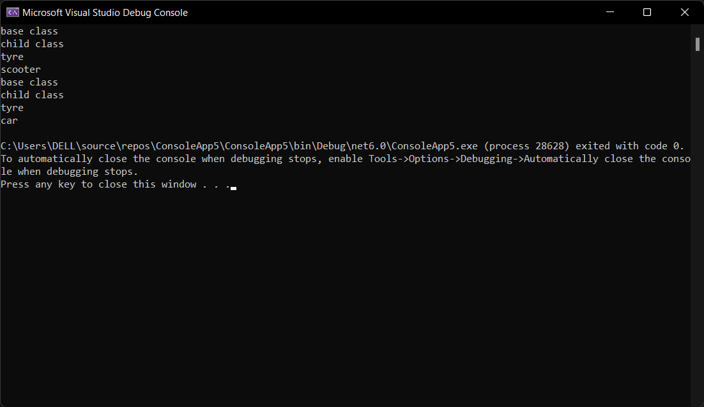

# Inheritance

## Aim:
To write a C# program to print some messages using hierarchical inheritance

## Algorithm:
### Step 1:
Create a base class Tyre.

### Step 2:
Create two child class.

### Step 3:
Create a constructor in the base class and print a message.

### Step 4:
create a function in child class to print a message.

### Step 5:
Run the program.

## Program:
~~~
Developed by : Kiran J
Ref no : 212221240022
~~~
~~~py
using System;
namespace vehicles
{
    public class tyre
    {
        public tyre()
        {
            Console.WriteLine("base class");
        }
        public virtual void Display()
        {
            Console.WriteLine("tyre");
        }
    }
    public class scooter : tyre
    {
        public scooter()
        {
            Console.WriteLine("child class");
        }
        public override void Display()
        {
            base.Display();
            Console.WriteLine("scooter");
        }
    }
    public class car : tyre
    {
        public car()
        {
            Console.WriteLine("child class");
        }
        public override void Display()
        {
            base.Display();
            Console.WriteLine("car");
        }
    }
    public class GFG
    {
        public static void Main(string[] args)
        {
            scooter Scooter = new scooter();
            Scooter.Display();
            car Car = new car();
            Car.Display();
        }
    }
}
~~~

## Output:

## Result
Thus, C# program to print some messages using hierarchical inheritance.